# Takakrypt Flow Diagrams

## 1. Application Access Flow

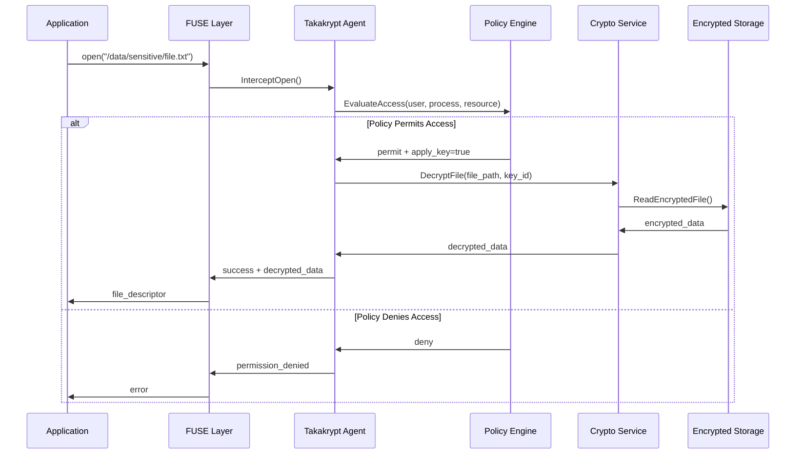

## 2. File Write Operation Flow

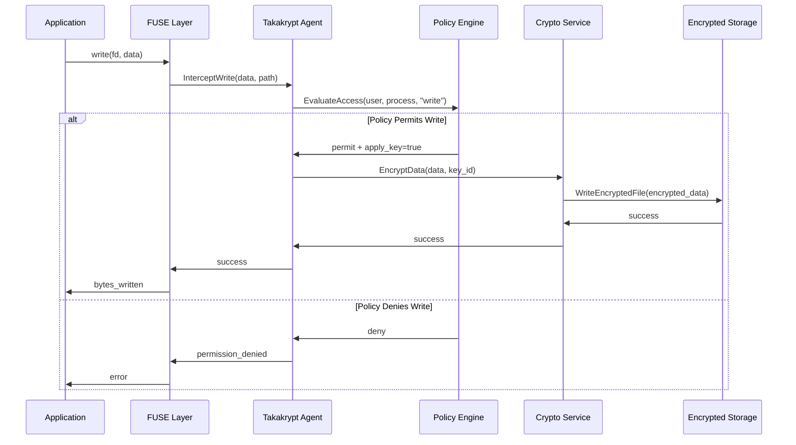

## 3. Policy Evaluation Flow

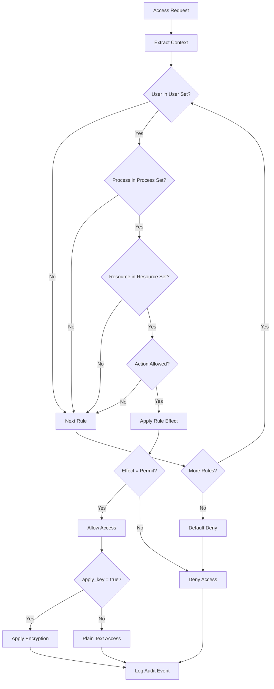

## 4. Encryption/Decryption Flow

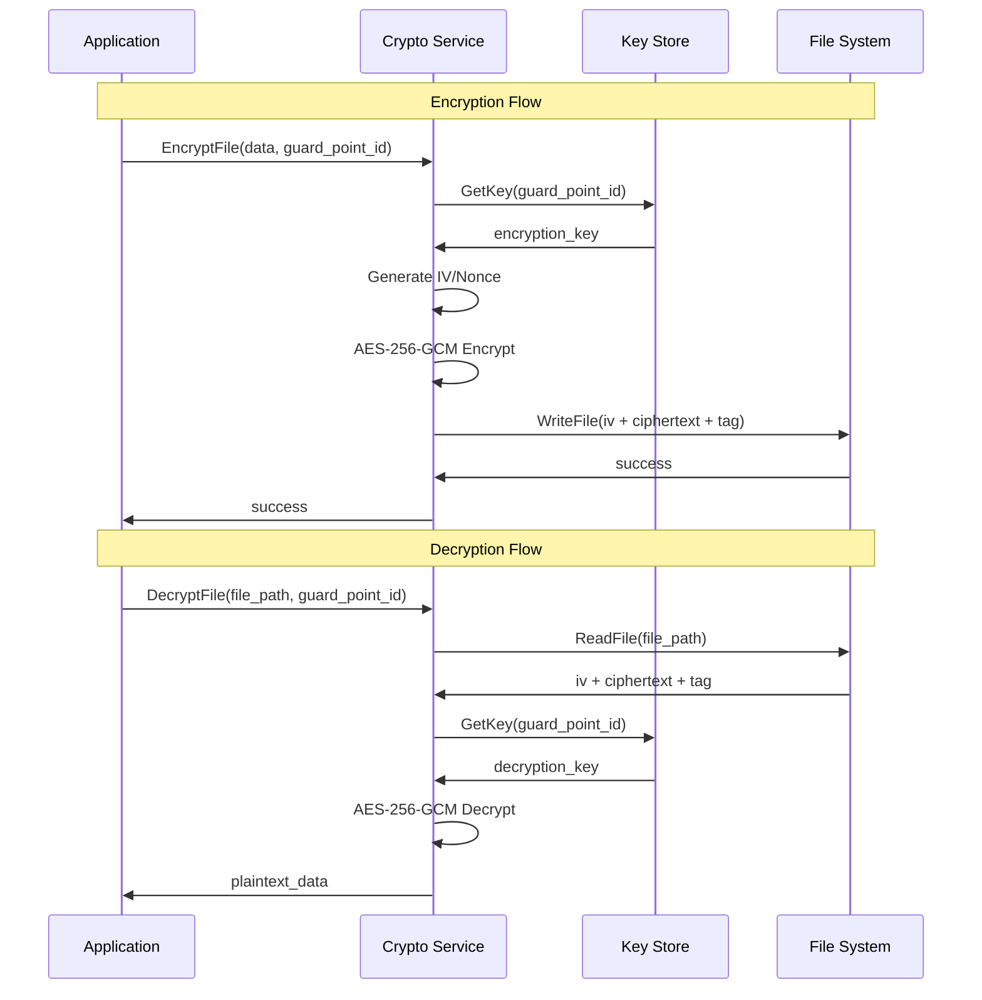

## 5. System Startup Flow

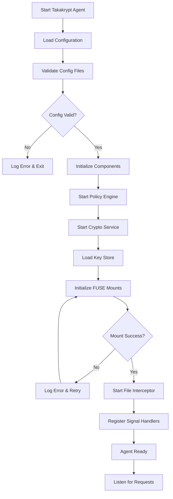

## 6. Database Application Flow

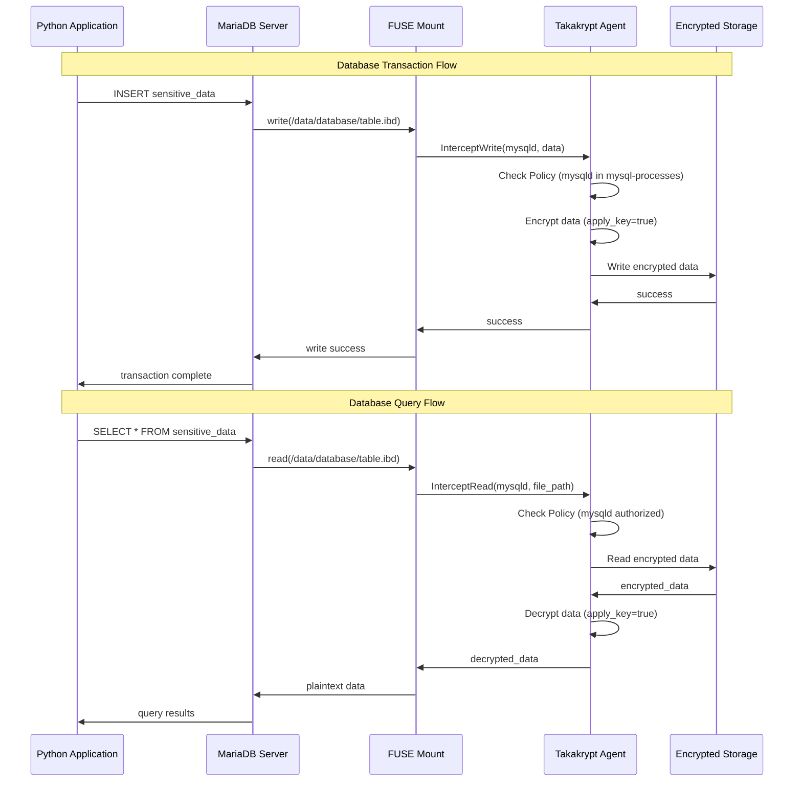

## 7. Process Set Enforcement Flow

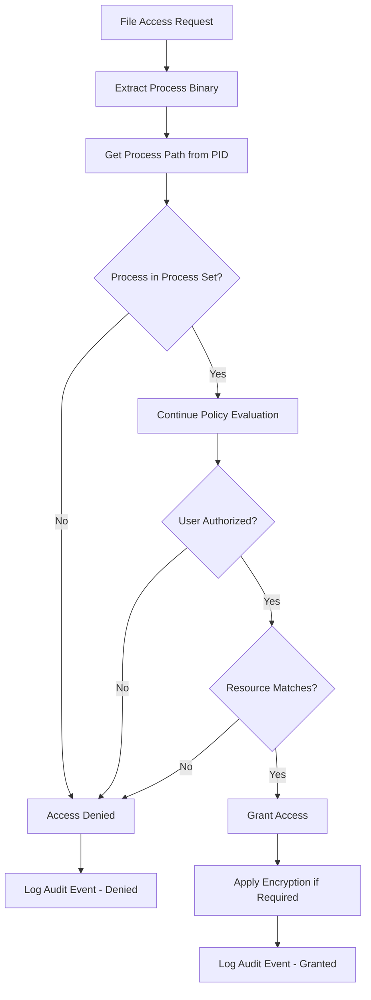

## 8. Key Management Flow

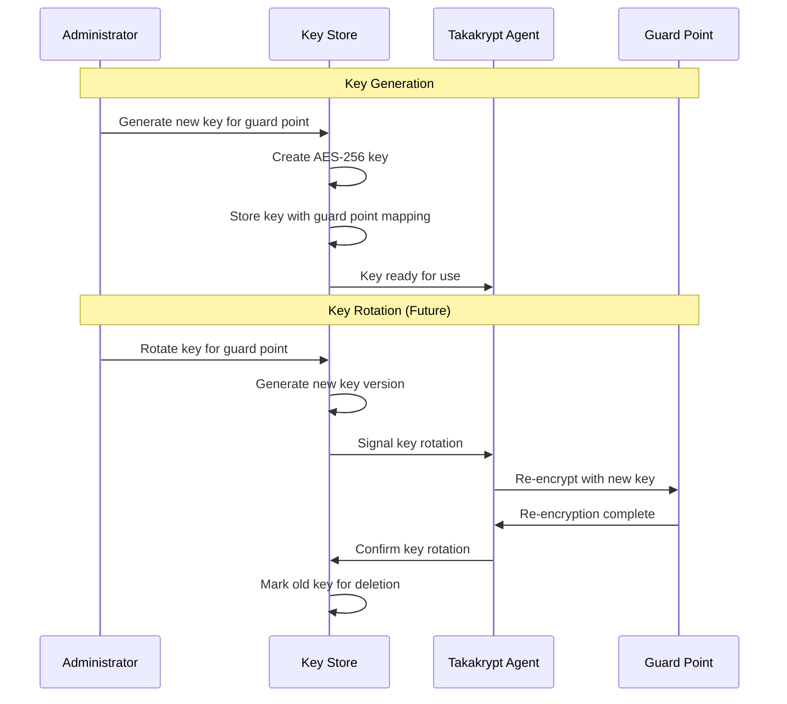

## 9. Audit and Logging Flow

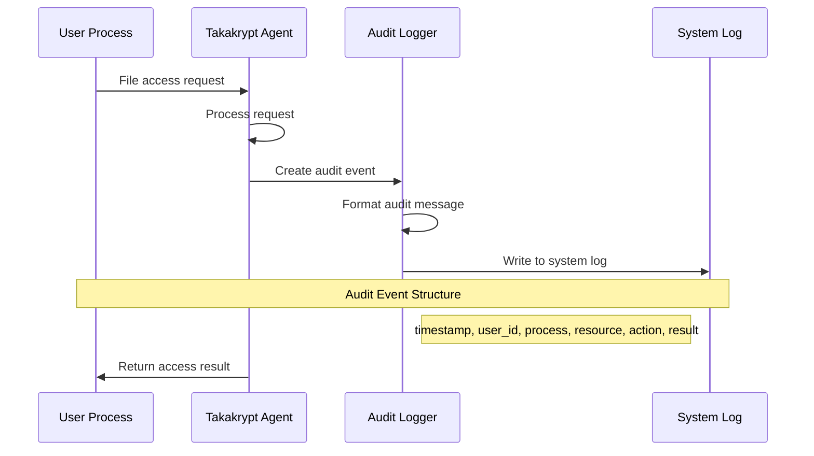

## 10. Error Handling Flow

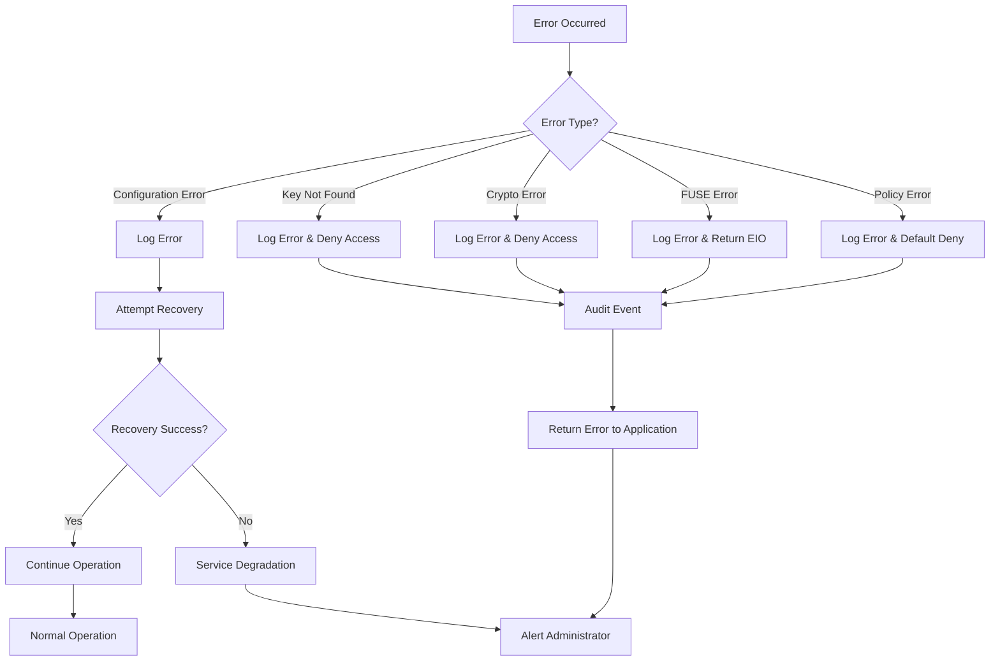

## 11. Configuration Reload Flow

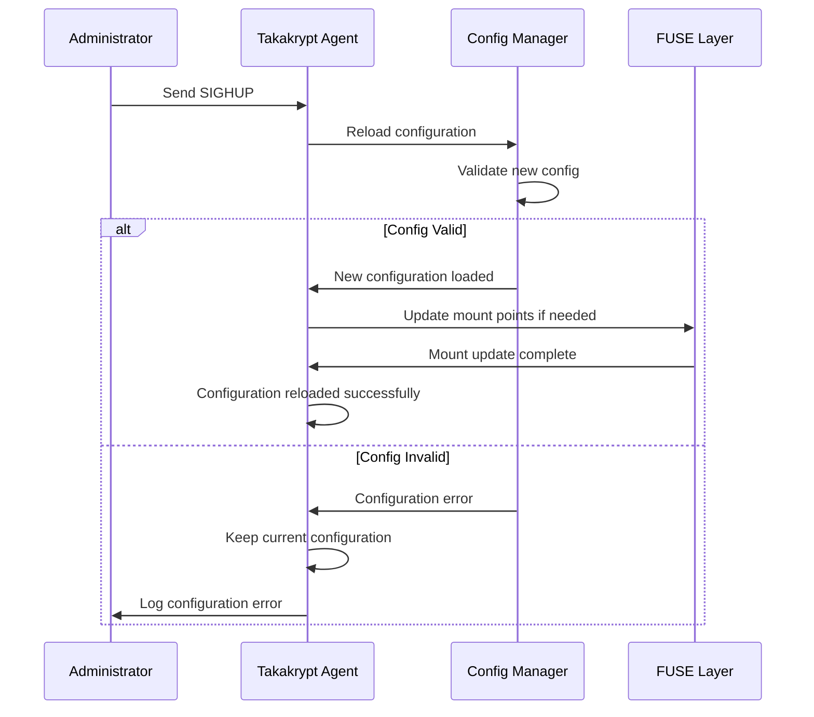

## 12. Multi-User Access Flow

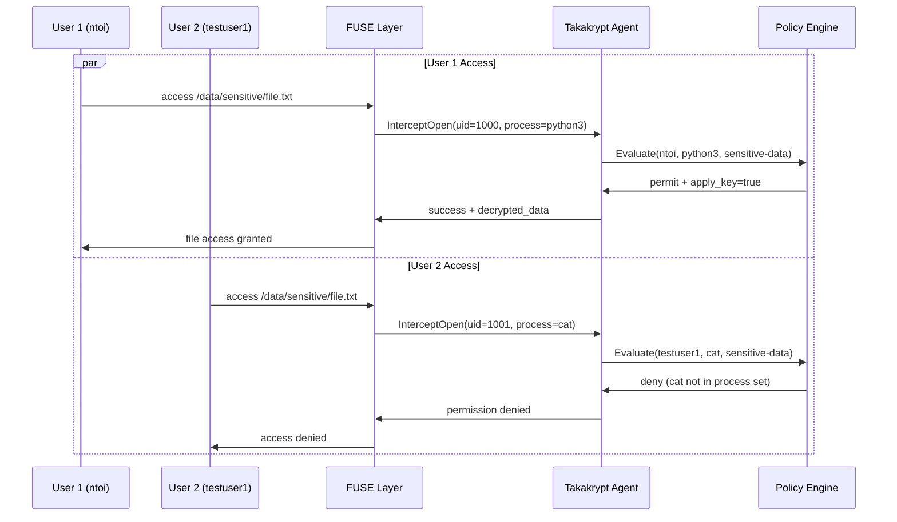

These flow diagrams illustrate the complete operational flow of the Takakrypt transparent encryption system, from application access through policy evaluation to encryption/decryption operations.